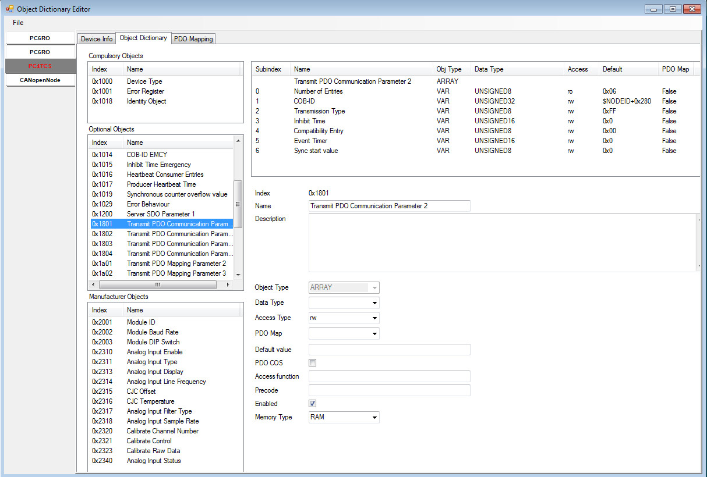
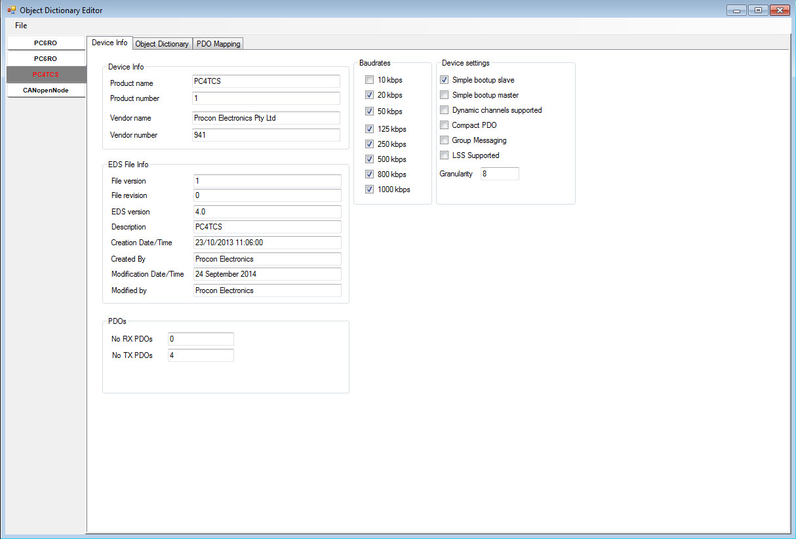
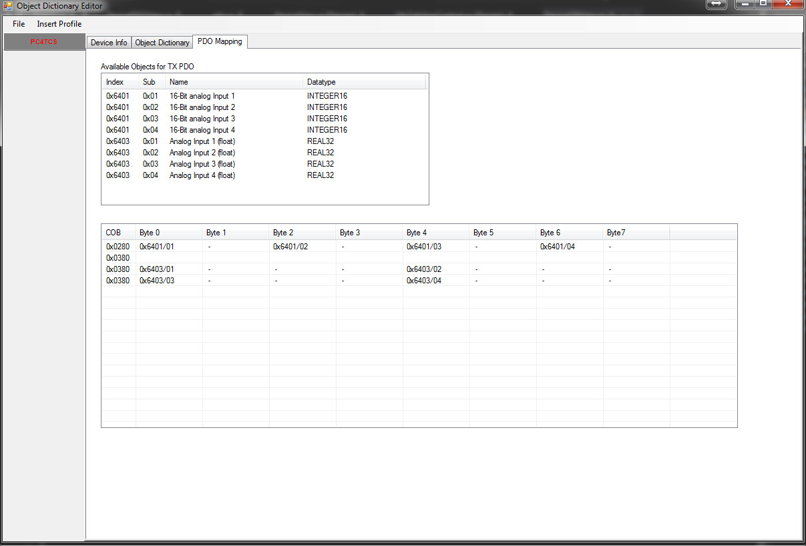
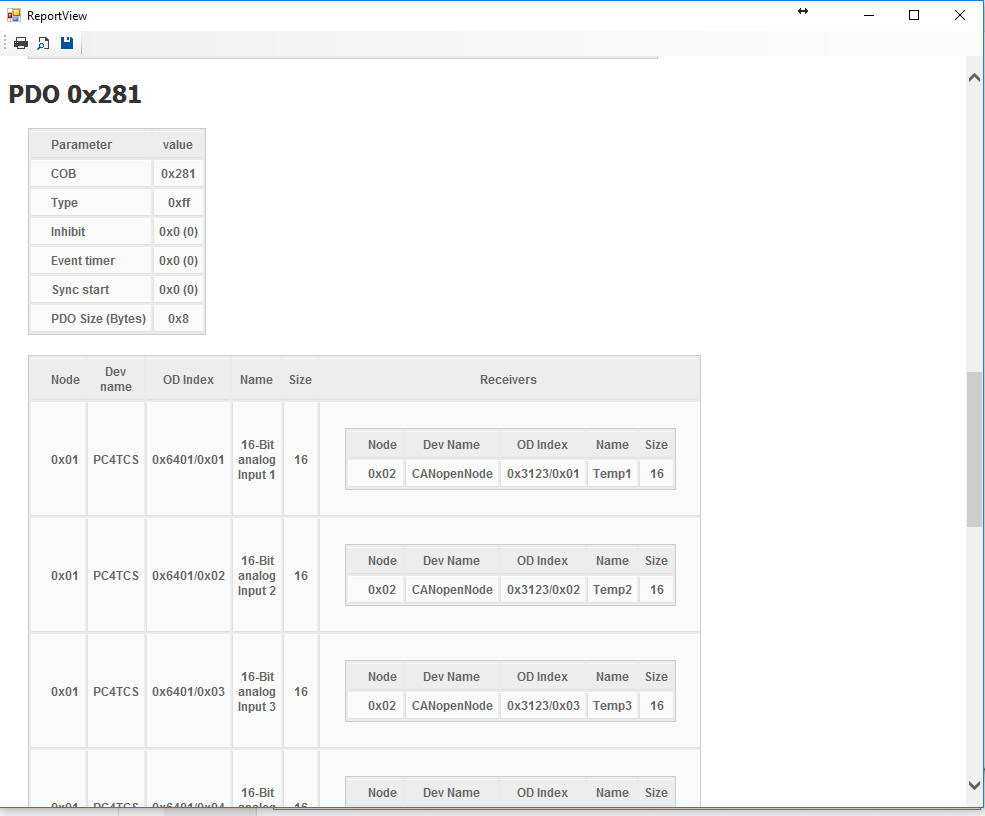

THIS BRANCH IS OBSOLETE PLEASE USE xdd branch

A C# CanOpen EDS (Electronic Data Sheet) library and GUI editor

This application is designed to load/save/edit and create EDS/DCF/XDC file for 
CanOpen and also to generate the object dictionary for CanOpenNode 
CO_OD.c and CO_OD.h) to aid development of CanOpenNode devices.

EDS (Electronic Data Sheet) files are text files that define CanOpen Devices.
DCF (Device Configuration File) files are text files that define configured 
CanOpenDevices XDD files are an XML version of EDS files 

EDS/DCF are fully defined in the DSP306 standard by the can open standards 
body CiA.

The EDS editor on its own is useful without the CanOpenNode specific export and 
as of the 0.6-XDD-alpha version the editor can also load/save XDD files. 
The GUI also shows PDO mappings and can generate reports
of multiple devices that are loaded into the software.

The core library can be used without the GUI to implement eds/xdd loading/saving
and parsing etc in other projects.

Please consider this code experimental and beta quality. 
It is a work in progress and is rapidly changing.

Every attempt has been made to comply with the revelant DSP306 and other 
standards and esd files from multile sources have been tested for loading and 
saving as been (at times) validated for errors using EDS conformance tools.

With many thanks to the following contributors for spotting my mistakes and 
improving the code
	* s-fuchs 
	* martinwag 
	* trojanobelix

Releases
--------

If you would like to try a pre compiled version, then head over to the 
[releases page!](https://github.com/robincornelius/libedssharp/releases)

Current Features

Library
-------

* Read EDS/DCF/XDC file and parse contents to approprate classes
* Dump EDS/DCF classes via ToString()
* Save EDS/DCF classes back to EDS file
* Read CanOpenNode xml project file
* Write CanOpenNode xmlproject file
* Switch formats between EDS/DCF and CanOpenNode XML (note to EDS will result in
  data loss as the format supports less information).
* Export C and H files in CanOpenNode format CO_OD.c and CO_OD.h
* EDS/DCF supports modules
* EDS/DCF supports compactPDO (read only) 1*
* EDS/DCF supports implict PDO (read only) 1*
* EDS/DCF supports CompactSubOb (read only) 1*
* Supports loading/saving of all EDS/DCF module information

1* read only in this context means the EDS/DCF is fully expanded but the compact
   forms is not written back, only the expanded form will be saved.

GUI
---
* Open multiple devices
* Open EDS/DCF/XDC files
* Save EDS/DCF/XDC files
* Open CanOpenNode XML Project file
* Save CanOpenNode XML File
* View OD Entries and explore the Object Dictionary
* Add new OD entries
* Delete exisiting OD entries
* Create new Devices
* Add default profiles
* Create profiles that can be added to any project (just save the device xml file to the profiles/ 
  directory, only include the minimum number of objects that you want to auto insert) This will auto add to insert menu
* Edit Device and File Info sections
* Set RX/TX PDO mappings easily from dropdown lists of avaiable objects
* Add and remove new PDO entries (communication paramaters and mapping) in a single button push
* Save groups of EDS/XML files as a network objects with abality to set concrete node IDs
* View report of all configured PDO across the network
* View modules and module details present within EDS files
* View/edit actual object values for device configuring/DCF files
* Support for loading XDD files (CanOpen offical XML)
* Support for saving XDD files (CanOpen offical XML)
* Some module info is displayed in GUI showing avaiable modules (eds) and 
  configured modules (dcf) and what OD entries they reference. Full details such
  as subobj extension and fixed subobj are not currently displayed and unless
  there is demand probably will not ever be.

TODO
----

* Ensure and validate all XDD is loading/save correctly (Looking good so far)
* Add extra Gui fields for accessing extra XDD paramaters not in EDS 
  (all common ones are done, a few special/edge cases remain)
* Look at XDC files and see if we can save config changes and allow editing and
  network setup here in the app, partial support is implemented by supporting 
  DCF files
  

BUGS
----

If you find any, please open a bug report on github and attach any files you
have created/opened etc.
  
Pictures
--------

